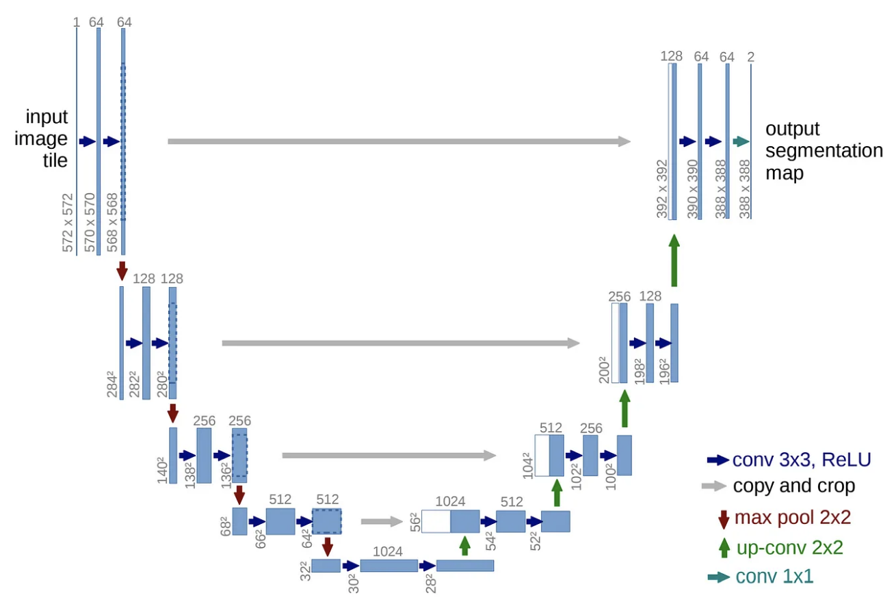

# Embedded SW Final Project

# 1. 배경 기술

## 1. U-Net과 CNN

**1) CNN(Convolutional neural network)**

  CNN이란 데이터로부터 직접 학습하는 딥러닝의 신경망 아키텍처로, 이미지와 같은 시각적 데이터를 분석하기 위한 가장 대표적인 신경망이다. CNN은 수십 또는 수백 개의 계층을 가질 수 있으며, 각 계층은 이미지의 서로 다른 특징을 검출한다. CNN은 컨벌루션 , 풀링, 완전 연결 층으로 구성되어 있으며, 이미지의 국소적인 특징을 효과적으로 학습한다.

- 장점 : CNN 모델은 이미지 인식 분야에서 뛰어난 성능을 지니고 있다. 또한 계산이 효율적이며, 공간 정보를 유지한다. 효율적인 구조를 지니고 있어서 과적합을 방지하기 좋다.
- 단점 : 작은 커널만으로는 전역적인 정보를 학습하기 어렵다. 학습 데이터가 많이 필요하며, 입력 데이터의 채널 수가 증가할수록 계산량과 파라미터 수가 크게 증가한다.

**2) U-Net**

  U-Net은 CNN 구조를 기반으로 한 딥러닝 모델로, 이미지 분할 작업에 특화되어 설계되었다. U-Net은 인코더와 디코더로 이루어져 있다. 인코딩 단계에서는 입력 이미지의 특징을 포착할 수 있도록 채널 수를 늘리면서 차원을 축소해 나가며, 디코딩 단계에서는 저차원으로 인코딩된 정보만 이용하여 채널 수를 줄이고 차원을 늘려서 고차원의 이미지를 복원한다.

 

## 2. 딥러닝 경량화 기법

**1) Dilated Convolution** 

  커널의 간격을 확장하여 더 큰 수용 영역을 확보하는 기법이다. 파라미터의 수를 증가시키지 않고 전역 정보를 학습할 수 있어 전역 특징 학습을 강화할 수 있다. DeepLab 같은 세그멘테이션 모델에 사용한다.

**2) Deformable Convolution**

  입력 데이터에 따라 커널이 유연하게 변형되어 특징을 추출하여 커널의 한계를 극복할 수 있는 기법이다. 비정형 데이터 학습에 효과적이며, 객체 검출 및 세그멘테이션 작업에 사용한다.

**3) Group Convolution**

  입력 채널을 여러 그룹으로 나누고 독립적으로 합성곱을 수행하는 기법이다. 계산량이 감소한다는 장점이 있지만, 그룹 간 정보 손실이 일어날 가능성이 있다. 이는 ShuffleNet 등에서 사용한다.

**4) Depthwise Separable Convolution**

  표준 합성곱을 각 채널을 독립적으로 합성곱 수행을 하는 Depth-Wise Convolution, 1x1합성곱으로 채널을 결합하는 Pointwise Convolution 두 단계로 나눈다. 이를 이용하면 계산량 및 파라미터 수가 감소하는 장점이 있으며, 모바일 및 임베디드 환경에서 경량화 모델을 구현하는 데 사용한다.

**5) Rank-1 Tensor Decomposition**

  SVD와 같은 기법으로 큰 행렬을 저차원으로 분해한다. 계산량 및 파라미터 수가 감소한다는 장점이 있으며, 네트워크 층의 복잡도 감소에 사용한다.

**6) Pruning**

  중요하지 않은 가중치를 제거하여 모델 크기를 줄이는 기법으로, 반복적인 제거와 재학습을 통해 효과적인 연결을 유지한다. 모델 크기와 계산량이 감소한다는 장점이 있으며, 모든 딥러닝 모델에서 사용이 가능하다. Doptout과 달리 영구적으로 가중치를 제거할 수 있다.

**7) Quantization**

  가중치와 활성화 값을 저비트로 표현함으로써 계산과 메모리 액세스 속도를 높이는 경량화 기법이다. 학습 후 양자화를 하는 Post-Training Quantization 기법과, 학습 중 양자화 시뮬레이션을 적용하는 Quantization Aware Training 기법이 있다. 모델 사이즈를 축소시켜 저장 용량을 효율적으로 관리할 수 있으며, 메모리와 계산 효율성이 향상한다. 모바일 및 임베디드 장치에 사용한다.

**8) Fire Module (SqueezeNet) (o)**

  1×1 합성곱인 Squeeze Layer로 채널 수 축소 후, 1×1 및 3×3 합성곱으로 확장하는 기법이다. 모델의 크기가 감소한다는 장점이 있으며, SqueezeNet에서 사용한다.

**9) 지식 증류 (Knowledge Distillation)** 

  큰 모델로부터 학습한 지식을 작은 모델로 전달하여, 작은 모델이 큰 모델과 유사한 성능을 내도록 하는 방법이다. 작은 모델의 크기와 계산량을 줄이면서도 성능을 유지하거나 향상시키는 것이 목적이다.

**10) ShuffleNet** 

  Group Convolution과 Shuffle Operation을 결합한 형태로, Shuffle Operation을 통해 그룹 간 정보를 교환한다. 파라미터의 수와 계산량이 감소하는 장점이 있고, 경량화와 성능 균형을 제공하는 곳에 쓰인다.

**11) EfficientNet**

  네트워크의 깊이, 너비, 해상도를 동시에 조정하여 모델 최적화하는 기법으로, scaling 기법을 사용하여 균형 잡힌 모델 확장한다. 고정밀도 및 효율성을 제공하여 성능과 효율성 요구를 충족한다.

# 2. 방법

  이론을 공부한 뒤, 여러 기법으로 UNet 모델을 경량화 해보았다. 그 결과 컨벌루션을 사용하는 것이 가장 최적일 것이라는 결론을 내렸다. 따라서 UNet 모델의 성능을 최대한 유지하면서 모델 크기를 줄이고, 연산 속도를 빠르게 하기 위한 경량화 방법으로 Group Convolution과 Dilated Convolution을 선택했다. 

**1) Group Convolution 기법**


group convolution 예시 사진

  Group Convolution은 입력 채널을 여러 그룹으로 나누어 각각 독립적인 컨벌루션 연산을 수행한다. 각 그룹에서 독립적으로 Conv2D 연산을 수행한 후, 결과를 병합하는 기법이다. 이를 통해 학습해야 할 파라미터 수가 줄어들어 모델이 더 가벼워지기에 모델의 크기를 줄이기 위해 사용했다.

```python
def group_conv2d(inputs, filters, kernel_size, groups=1, **kwargs):
    input_channels = inputs.shape[-1]
    channel_per_group = input_channels // groups

    # Grouped Convolution
    outputs = []
    for g in range(groups):
        start = g * channel_per_group
        end = (g + 1) * channel_per_group
        grouped_input = inputs[..., start:end]
        conv = layers.Conv2D(filters // groups, kernel_size, **kwargs)(grouped_input)
        outputs.append(conv)

    return layers.Concatenate(axis=-1)(outputs)
```

  입력 텐서의 채널 수를 가져온 뒤, 입력 데이터를 몇 개의 그룹으로 나눌 지 정의하고, 각 그룹에 포함되는 채널 수를 계산한다. 입력 채널의 특정 부분을 선택하여 선택된 부분에 대해 Conv2D 연산을 수행한다. 각 그룹에서 계산된 결과를 리스트에 저장하고, 결과를 하나의 출력 텐서로 병합한다.

  초기 레이어에서는 그룹 수를 낮게 설정하여 전체 채널에 대해 정보를 학습하고, 이후 레이어에서 그룹 수를 증가시켜 연산량을 줄이는 방법을 사용한다.

**2) Dilated Convolution 기법**


  Dilated Convolution은 필터의 리셉티드 필드를 확장하기 위해, 필터 내 커널 요소 간에 간격을 추가하는 컨벌루션 기법이다. 

```python
conv3 = group_conv2d(conv3, 128, 3, groups=2, dilation_rate=2, padding='same')
conv4 = group_conv2d(conv4, 256, 3, groups=4, dilation_rate=4, padding='same')
```

  코드 내에서 사용하는 예시이다. 필터 요소 간의 간격을 2 또는 4로 설정하여 더 넓은 영역의 정보를 학습하도록 한다. 제로 패딩을 통해 확장된 필터로 입력과 출력의 크기를 유지한다. dilated 컨벌루션은  모델의 중간 레이어에 사용하여 계산 효율성을 유지하도록 한다.

**3) 모델 크기 및 효율성 계산**

(1) 모델 파라미터 크기 계산

```python
def get_model_param_size(model):
    total_params = model.count_params()
    size_in_mb = (total_params * 4) / (1024 ** 2)  # 4 bytes per 파라미터
    print(f"Model parameter size: {size_in_mb:.2f} MB")
    return size_in_mb
```

  모델의 크기를 계산하여 경량화 효과를 수치로 검증한다. 파라미터 수와 메모리 사용량을 분석하여 모델이 얼마나 경량화되었는지 확인한다.

(2) 추론 시간 측정

```python
def measure_inference_time(model, X_sample):
    import time
    start_time = time.time()
    model.predict(X_sample, batch_size=1)  # 샘플 단위로 추론 시간 측정
    end_time = time.time()
    inference_time = (end_time - start_time) / len(X_sample)
    print(f"Inference time per sample: {inference_time:.4f} seconds")
    return inference_time
```

  경량화된 모델이 실제로 추론 속도에서 얼마나 효율적인지 평가하는 코드를 추가하여 경량화의 실질적인 효과를 확인하도록 한다.

### 4. Raspberry Pi로 Interference하기

먼저 추론하기 위해 모델에 tflite.convert 함수를 추가하였다.

```python
converter = tf.lite.TFLiteConverter.from_keras_model(model)
tflite_model = converter.convert()
```

변환된 tflite 모델을 라즈베리 파이에서 돌리기 위한 코드를 만든 후 추론하였다. 5개의 샘플을 임의로 추출한 후 결과를 뽑아내게 코드를 작성했다.

```python
num_samples = 5  # Number of samples to display
plt.figure(figsize=(15, 5 * num_samples))

for i in range(num_samples):
    plt.subplot(num_samples, 3, i * 3 + 1)
    plt.title('Original Image')
    plt.imshow(X_test[i])
    plt.axis('off')

    plt.subplot(num_samples, 3, i * 3 + 2)
    plt.title('Ground Truth Mask')
    plt.imshow(y_test[i, :, :, 0], cmap='gray')
    plt.axis('off')

    plt.subplot(num_samples, 3, i * 3 + 3)
    plt.title('Predicted Mask')
    plt.imshow(predicted_masks[i], cmap='gray')
    plt.axis('off')

plt.tight_layout()
plt.show()
```

# 3. 결과

### 1) 기존의 U-Net 알고리즘으로 코드를 실행


| Parameter | 1,925,601 |
| --- | --- |
| Size in MB | 7.3456MB |
| Inference Time | 0.3888s |
| Dice_Coef | 0.5128 |

### 2) 경량화 결과(Group Convolution + Dilated Convolution )


| Parameter | 1,075,265 |
| --- | --- |
| Size in MB | 4.10MB |
| Inference Time | 0.0781s |
| Dice_Coef | 0.4274 |

### 3) 비교

| Metric | Basic Model | Lite Model | Improvement/Change |
| --- | --- | --- | --- |
| Dice Coefficient | 0.5128 | 0.4274 | -16.6% (정확도 감소) |
| Inference Time | 0.3888s | 0.0781s | +80% (속도 향상) |
| Model Size | 7.3456MB | 4.10MB | -44% (크기 감소) |

### 4) Raspberry Pi 추론 결과

5개의 샘플의 구분 결과와 손실 그래프는 다음과 같다.


# 4. 논의

## 1. 각 경량화 기법의 성능 비교

### 1) ShuffleNet 기법을 사용한 U-Net 코드 실행

기존의 BP-Segmentation 코드에 ShuffleNet 기법을 사용하였다.

ShuffleNet은 Grouped Convolution과 DepthWise Seperable Convolution 2가지의 합성곱으로 연산하며, 합성곱층에서 일부만 고려하고, 모든 채널에 대해 고려하기 위해 채널을 Shuffling 한다. 따라서, Grouped Convolution 코드와 DepthWise Seperable Convolution 함수를 추가하고, 채널을 섞는 코드까지 구현했다.


성능은 다음과 같이 나왔다.


| Parameter | 338,705 |
| --- | --- |
| Size in MB | 1.29MB |
| Inference Time | 0.0923s |
| Dice_Coef | 0.2466 |

### 2) Quantization 기법을 이용한 U-Net 코드 실행

TensorFlow Lite의 PTQ 기능을 활용하여 UNet 모델을 양자화한다. 이를 위해서 기존의 U-Net 코드를 tflite로 변환해야 한다. 따라서, apply_post_training_quantization 함수를 다음과 같이 만들었다.


Quantization 기법을 사용한 U-Net 코드의 성능은 다음과 같이 나왔다.


| Size in MB | 1.87MB |
| --- | --- |
| Inference Time | 0.2126s |
| Dice_Coef | 0.5008 |

### 3) Grouped Convolution 기법을 이용한 U-Net 코드 실행


| Parameter | 845,637 |
| --- | --- |
| Size in MB | 3.32 |
| Inference Time | 0.6417s |
| Dice_Coef | 0.2862 |

### 4) Dilated Convolution 기법을 이용한 U-Net 코드 실행


dilation rate는 합성곱 신경망에서 사용되는 파라미터로, 필터가 입력 데이터에서 얼마나 멀리 떨어진 픽셀을 참조할지를 결정한다. dilation rate를 그림과 같이 설정하고 모델을 실행하면, 성능은 다음과 같다.


| Parameter | 1,925,601 |
| --- | --- |
| Size in MB | 7.35MB |
| Inference Time | 0.0462s |
| Dice_Coef | 0.4833 |

## 2. 결과 해석

### 1) 기본 모델과 경량화 모델 비교

**(1) 모델 크기 감소**

  기본 모델의 경우 7.345MB의 크기를 가지지만, 경량화된 모델은 4.10MB로 약 44.2% 감소하였다. 그룹 컨벌루션과 필터 수 조정을 통해 파라미터 수를 줄이고, 모델 크기를 효과적으로 경량화하였다.

**(2) 추론 속도 향상**

   기본 모델은 0.3888초/샘플 정도의 추론 시간이 걸렸지만, 경량화된 모델은 0.0781초/샘플로 속도가 약 80% 이상 크게 개선되었다. 그룹 컨벌루션과 dilated 컨벌루션을 활용한 경량화 구조가 연산량을 크게 감소하였음을 알 수 있다.

**(3) 성능 유지**

  기본 모델은 0.5128의 성능을 가졌으나, 경량화된 모델은 0.4274로 약 16.6%감소했다. 경량화를 위해 모델 구조를 단순화하며 발생한 정보 손실로 인해 정확도가 낮아진 것으로 보인다. 그러나 다른 경량화 기법보다 우수한 성능을 지녔으며, 기존 모델의 성능을 최대한 유지하였다.

**(4) 그래프 비교**

- **손실 그래프 (Loss)**
    - 학습 데이터(`Train`)의 손실은 Epoch이 진행될수록 꾸준히 감소했다.
    - 검증 데이터(`Validation`)의 손실은 학습 초반 급격히 감소했지만, 이후 어느 정도 **수렴**하는 경향을 보였다.
    - **해석**: 학습이 잘 진행되었으며, 과적합 문제가 크지 않음을 의미한다.
- **Dice Coefficient 그래프**
    - 학습 데이터의 Dice Coefficient는 Epoch이 진행될수록 꾸준히 증가했다.
    - 검증 데이터의 Dice Coefficient는 **0.43** 근처에서 수렴했다.
    - **해석**: 경량화 모델이 검증 데이터에서도 안정적으로 동작하며, 학습 과정이 효과적임을 보여준다.

### 2) 경량화 모델의 한계

- 입력 채널을 나누어 처리하면서 일부 중요한 정보가 손실될 가능성이 있다. 특히, 작은 그룹 수를 사용할 경우 특징 학습이 제한될 수 있다.
- 높은 dilation rate를 사용한 레이어에서 고해상도 세부 정보가 손실될 수 있다. 이는 객체의 세부 경계 예측에서 오류로 이어졌을 가능성이 크다.
- 필터 수를 줄이면서 초기 레이어에서 정보가 충분히 추출되지 않을 가능성이 있다.

### 3) 최종 결론

  

- 경량화된 모델은 기본 모델 대비 **모델 크기**와 **추론 속도**에서 큰 이점을 제공하며, **정확도** 또한 다른 경량화 모델에 비해 좋게 나왔다.
- **그룹 컨벌루션**과 **확장 컨벌루션**을 활용하여 파라미터 수와 연산량을 줄였으며, 고해상도 정보와 문맥 정보를 효과적으로 학습했다.
- 이로 인해, 모델 크기 감소와 속도 향상은 물론 세그멘테이션 작업에서 성능을 최대한 유지할 수 있었다.

  따라서 초기 목표인 성능은 최대한 유지하면서, 속도와 모델 크기를 개선하는 경량화 모델을 만들었다.